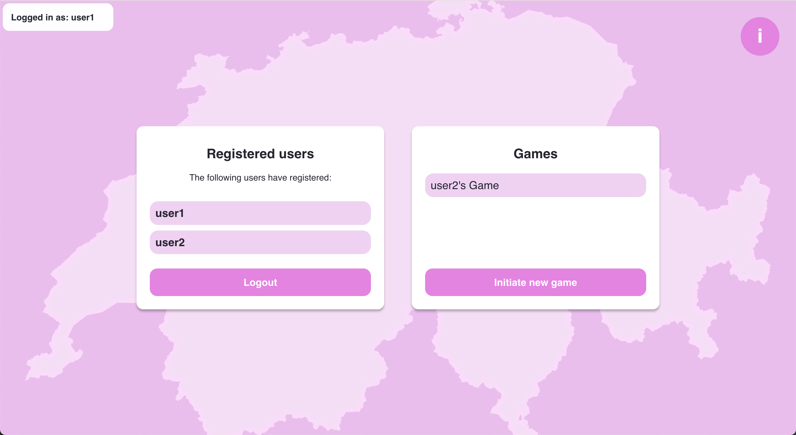
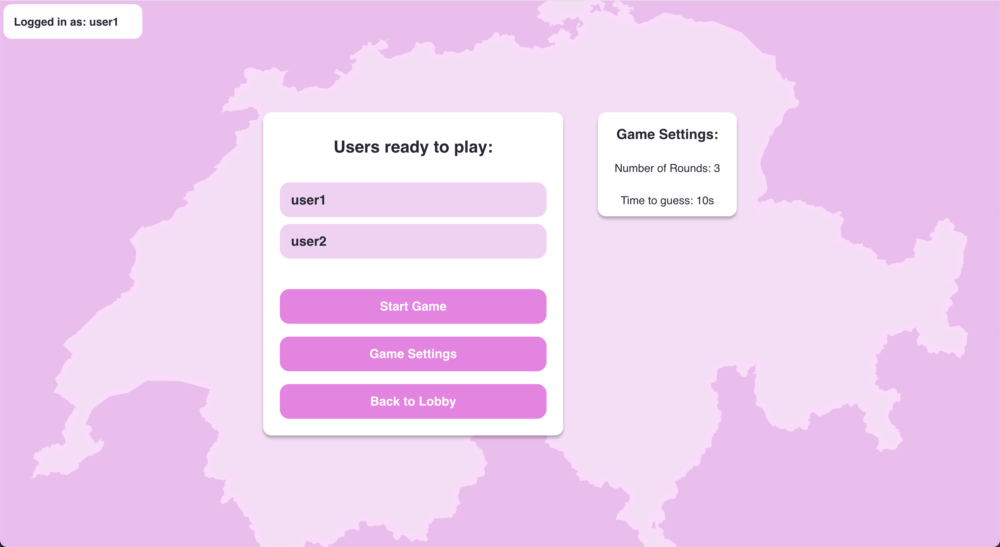
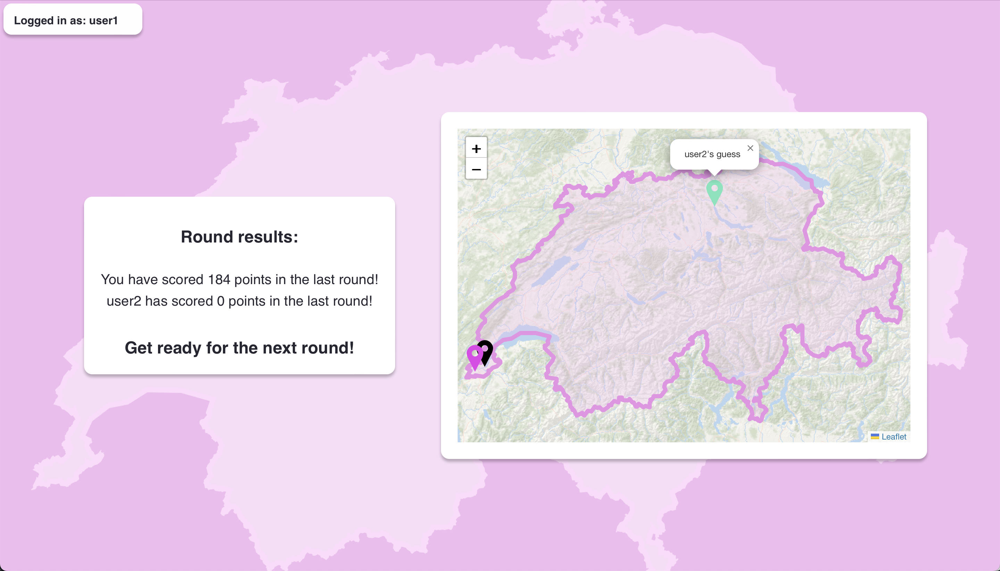
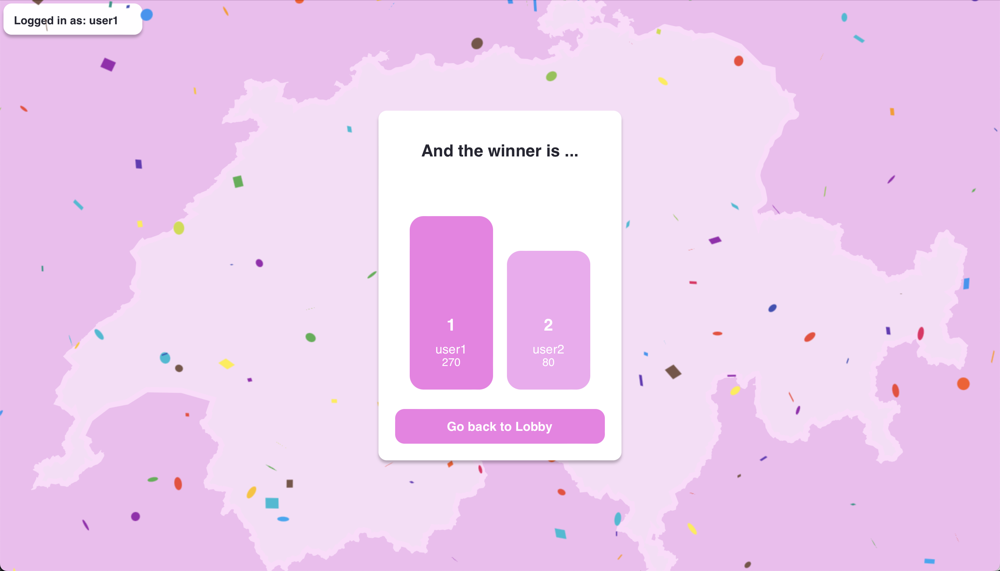

# SwissQuiz


## 📖 Table of Contents

1. [Introduction](#introduction)
2. [Technologies](#technologies)
3. [High-level Components](#high-level-components)
4. [Launch & Development](#launch--development)
5. [Roadmap](#roadmap)
6. [Authors](#authors)
7. [Acknowledgments](#acknowledgments)
8. [License](#license)

## Introduction <a name="introduction"></a>

SwissQuiz is an interactive online quiz about the geography of Switzerland. In each round, players will be shown a random image taken somewhere in Switzerland. Your task is to guess where the image was taken by clicking on a map of Switzerland. The application thus allows you to discover and explore the beauty of Switzerland in a playful manner.

## Technologies <a id="technologies"></a>

The following technologies were used for front-end development:

* [JavaScript]() - Programming language
* [REACT](https://reactjs.org/) - JavaScript library used for building user interfaces
* [React Leaflet](https://react-leaflet.js.org) - React libarary used for generating maps of Switzerland
* [Axios API](https://axios-http.com/docs/api_intro) - JavaScript library used for REST-based communication with the server
* [Stomp](https://stomp-js.github.io/stomp-websocket/) - Messaging protocol used for websocket communication with the server
* [Unsplash API](https://unsplash.com/documentation) - API used for importing pictures into the game

## High-level Components <a id="high-level-components"></a>

### GameSetup

The [GameSetup component](https://github.com/sopra-fs24-group-37/sopra-fs24-client/blob/main/src/components/views/GameSetup.tsx) is a pivotal element of our application, enabling users to create new games seamlessly. Accessing the GameSetup view automatically creates a game object in the backend via a websocket connection. The relevant game is then automatically displayed in the [Lobby component](https://github.com/sopra-fs24-group-37/sopra-fs24-client/blob/main/src/components/views/Lobby.tsx) component, where other users can join by clicking on it. The creator of the game, known as the "game master," has the authority to configure key game settings in the [GameSettings component](https://github.com/sopra-fs24-group-37/sopra-fs24-client/blob/main/src/components/views/GameSettings.tsx), such as the guessing time for each round (10, 20, or 30 seconds) and the total number of rounds (3, 5, or 10). Additionally, the game master can set the game to private, which generates a unique six-digit PIN. This PIN must be entered by other users to join the private game, ensuring controlled access. Applying the game parameters updates the relevant game object via a websocket connection. 
  
### GameRound

The [GameRound component](https://github.com/sopra-fs24-group-37/sopra-fs24-client/blob/main/src/components/views/GameRound.tsx) is the core of our application, managing the entire game flow. In each round, players are presented with a random image sourced from the Unsplash API, which is distributed to all participants via a websocket connection from the backend. Players then guess the location where the image was taken by clicking on a map of Switzerland.

To enhance gameplay, players can use three distinct power-ups, each available once per game:

- **Double Score**: Doubles the points for the current round.
- **Canton Hint**: Highlights the boundaries of the canton where the image was taken.
- **Triple Hint**: Highlights the boundaries of three cantons, one of which contains the location where the image was taken.

At the end of each round, players' guesses and information about the used power-ups are transmitted back to the backend via the websocket connection.

### SwissMap

The [SwissMap component](https://github.com/sopra-fs24-group-37/sopra-fs24-client/blob/main/src/components/ui/SwissMap.tsx) is crucial for our application, as it allows players to submit guesses during a game round. The application was built using the [React Leaflet library](https://react-leaflet.js.org) and uses the [World Ocean Base layer by Esri](https://hub.arcgis.com/datasets/esri::world-ocean-base/about) in combination with geojson dataset from [swisstopo](https://www.swisstopo.admin.ch/de/landschaftsmodell-swissboundaries3d) to render the geographical surface as well as  the national boundaries of Switzerland. A second geojson dataset is used to dynamically render the boundaries of cantons if a related power-up is used (see above). The map tracks the location guesses made by players and communicates them to the [GameRound component](https://github.com/sopra-fs24-group-37/sopra-fs24-client/blob/main/src/components/views/GameRound.tsx), into which it is visually integrated. 

## Launch & Development <a id="launch--development"></a>

### Prerequisites

To get startd with our application, please download [Node.js](https://nodejs.org). All other dependencies, including React, will then be automatically installed with the following command:

```npm install```

### Commands to build and run the project locally

Start the application with: `npm run dev`

Open [http://localhost:3000](http://localhost:3000) to view the application in the browser.

### Tests

Run the tests with: `npm run test`

### Build

To build the app, run `npm run build`

### Deployment

The application is automatically deployed via the Google App Engine when being pushed to main. 

### External dependencies

For the applicaton to work properly, both the frontend and the backend have to be running.

### Contributing
If you would like to contribute to our application, we kindly ask you to get in touch with the authors first. If you would like to add new functionalities, please create a separate branch on github to do so. Once you have tested your code and made sure that it is running properly, you can submit it via a pull request to the main repository. 

### Releases 
Github offers the following [tutorial](https://docs.github.com/en/repositories/releasing-projects-on-github/managing-releases-in-a-repository) for managing releases. Please follow the guidelines stated there and be sure to properly document and comment your release. 

## Illustrations <a id="illustrations"></a>

Once users have registered and logged in, they can create new games or join existing games in the Lobby view:



Users have a joined a game will be redirected to the GameSetup view. Here, the game master (i.e. the user who initiated the game) can access the game's parameters and set the number of rounds to be played and the round time. Also, the game can be protected with a password. Once the parameters have been set and at least one other user has joined the game, the game master can start the game.



The users are then redirected to the GameRound view. To the left, they will see an image that was taken somewhere in Switzerland. They have now the task to guess where this image was taken by clicking on the map of Switzerland shown to the right. To make the game more interesting, users have a number of power-ups at their disposal, which they can use once per game. These power-ups can help them to improve the accuracy of their guesses by providing geographical clues or to increase their round score by doubling the points for a given guess.


In between game rounds, users will be shown the Waiting view. Here, they are shown the points scored by individual players in the last round as well as all the submitted guesses together with the correct location.



Once the game is over, users will be redirected to the Podium view, which shows the overall scores for all users and ranks them accordingly.



## Roadmap <a id="roadmap"></a>

Here are some suggestions on how to expand the existing application:

- **Editable avatar icons**: Players are prompted to select an avatar icon when registering for the first time. This avatar icon can then be changed in the user profile view. 
- **Image filtering for games**: In the GameSettings view, players can select different filtering parameters which are then applied to the images imported from the Unsplash API. Such filters could be geographical (e.g. only import images from a certain area) or topical (e.g. only import images of cities).
- **Overview of images displayed during the game**: After a game has ended, players have the option to go to a view that lists all the pictures that were shown during the game.  

## Authors <a id="authors"></a>

* [Gian-Luca Führer](https://github.com/gf237) - client
* [Manuel Widmer](https://github.com/manuel-widmer) - client
* [Diana Hidvégi](https://github.com/DiaHidvegi) - server
* [Andri Spescha](https://github.com/Skyl3ss) - server

## Acknowledgments <a id="acknowledgements"></a>

We would like to thank [Fengjiao Ji](https://github.com/feji08) for guiding us through the course in her capacity as teaching assistant. Also, we would like to acknowledge the following providers of opensource data that were crucial in creating our application:

- **[Unsplash](https://unsplash.com/de)**: provider of high quality images of Switzerland (and beyond)

- **[swisstopo](https://www.swisstopo.admin.ch/de)**: provider of geojson data for the national boundaries and canton boundaries of Switzerland

- **[Esri](https://www.esri.com/en-us/home)**: provider of the World Ocean Base tile used for rendering the geographical surface of Switzerland

Sound effects were created with [GarageBand](https://www.apple.com/de/mac/garageband/). The entry melody played when going to the login or registration area is absed on the first two bars of the [Swiss Psalm](https://de.wikipedia.org/wiki/Datei:Schweizerpsalm.svg). 

## License <a id="license"></a>

This project is licensed under the GNU GPLv3 License. 

</div>